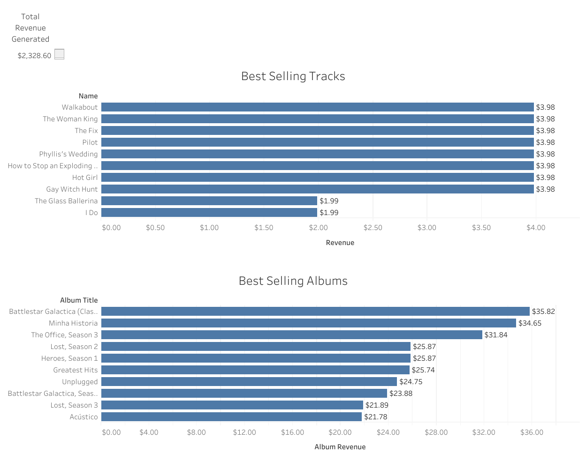

# Digital Media Trends

This project applies my SQL skills in a realistic setting using the Chinook dataset, a database simulating a digital media store. To emulate a real-world scenario, I am posing as an analyst responding to questions from a CEO. My goal is to create and interpret SQL query results, translate them into understandable insights for someone without technical expertise, and visualize the data using Tableau.

## Tech Stack
- **Tools:** SQL
- **Visualization:** Tableau

## Queries
Check out the SQL queries in the [queries.sql file](https://github.com/jerrybach98/sql-digital-media-trends/blob/main/queries.sql).

## Key Insights:
The CEO has asked the following questions:
#### Revenue and Sales Metrics
- What is the total revenue generated by the store?
- What are the top 10 best-selling tracks and albums by revenue?

#### Music and Artist Insights
- What genres of music are most popular?

#### Geographic Insights
- Which cities or countries generate the most revenue?

#### Transaction and Seasonal Trends
- Are there specific times of the year when sales are higher or lower?

#### Customer Insights
- What can you tell me about our customers that are spending the most on their favorite artists?

## Visualizations:
 

## Lessons learned:
- The end-to-end querying to visualization process mimics a real-world scenario, providing practical experience beyond online querying exercises.
- Researching formatting conventions help readability, clarity, and collaboration.
- The importance of the ability to explain queried data to those without technical expertise.
- Subqueries/nested queries are essentially queries on a temporary table generated by another query.
- Window functions can elminate the need for creating multiple queries. 
- Adaptation for differences in SQL database management systems such as function availability/names and small syntax nuances.
- Similar to coding, there are many ways to query data to produce the same results.

## Further ehancements:
- Practice time-based analysis and advanced SQL syntax with window functions (LAG, LEAD, RANK, ETC) then visualize those results.