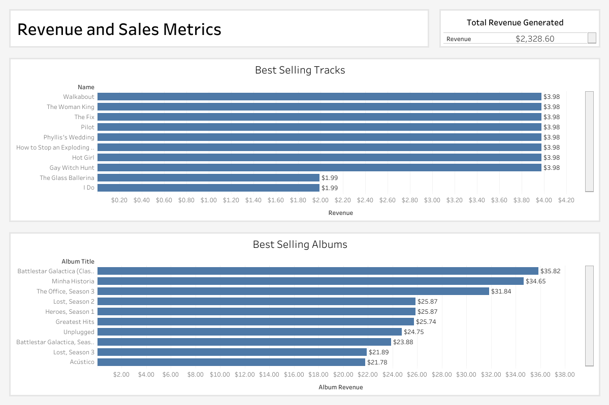
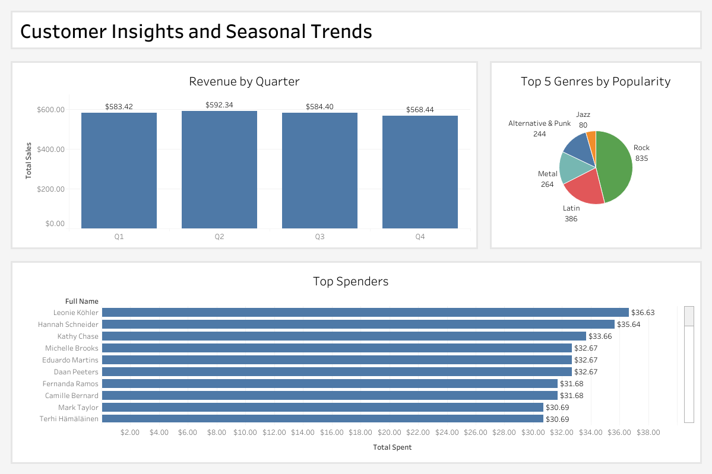
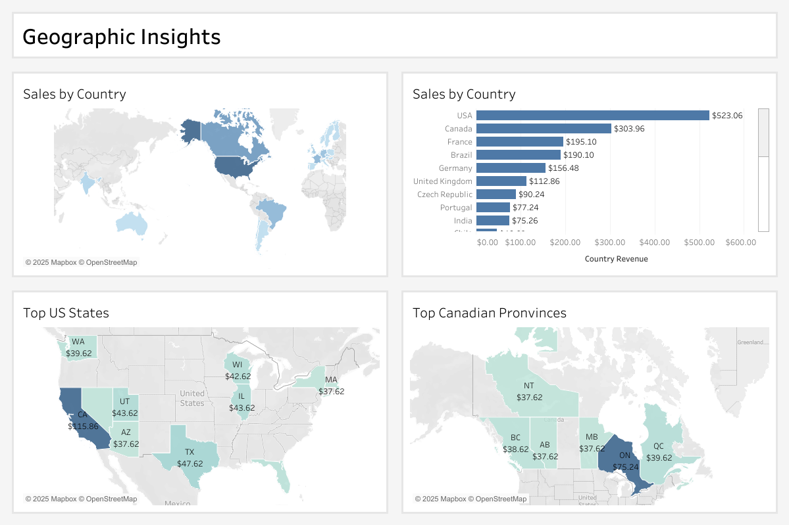

# Digital Media Trends

This project applies my SQL skills in a realistic setting using the Chinook dataset, a database simulating a digital media store. To emulate a real-world scenario, I am posing as an analyst responding to questions from a CEO. My goal is to create and interpret SQL query results, translate them into understandable insights for someone without technical expertise, and visualize the data using Tableau.

## Tech Stack
- **Tools:** SQL
- **Visualization:** Tableau

## Queries
Check out the SQL queries in the [queries.sql file](https://github.com/jerrybach98/sql-digital-media-trends/blob/main/queries.sql).

## Key Insights:
The CEO has asked the following questions:
#### Revenue and Sales Metrics
- What is the total revenue generated by the store?
The store brought in a total revenue of $2328.60. 
- What are the top 10 best-selling tracks and albums by revenue?
The top-selling tracks by revenue are: Hot Girl, Walkabout, Gay Witch Hunt, How to Stop an Exploding Man, Pilot, Phyllis's Wedding, The Fix, The Woman King, I Do, and The Glass Ballerina. This ranking is based on revenue generated, though we also have the option to analyze by the quantity of tracks sold for further insights.  
The top-selling albums by revenue are: Battlestar Galactica (Classic), Season 1, Minha Historia, The Office, Season 3, Heroes, Season 1, Lost, Season 2, Greatest Hits, Unplugged, Battlestar Galactica, Season 3, Lost, Season 3, and Acústico. Since albums are not sold as a single product, the revenue figures reflect the sales of individual tracks within each respective album.

 

#### Music and Artist Insights
- What genres of music are most popular?

#### Geographic Insights
- Which cities or countries generate the most revenue?

#### Transaction and Seasonal Trends
- Are there specific times of the year when sales are higher or lower?

#### Customer Insights
- What can you tell me about our customers that are spending the most on their favorite artists?

## Visualizations:
 
 

## Lessons learned/Thoughts:
- The end-to-end querying to visualization process mimics a real-world scenario, providing practical experience beyond online querying exercises.
- Researching formatting conventions for readability applies to SQL as well although there is no official guide. 
- The importance of the ability to explain queried data to those without technical expertise.
- Subqueries/nested queries are just queries on a temporary table generated by another query.
- Window functions can elminate the need for creating multiple queries.
- Adaptation for differences in SQL database management systems such as function availability/names and small syntax nuances.
- Similar to coding, there are many ways to query data to produce the same results.
- Like CSS for websites, appealing Tableau visuals can use containers, color, layout, and hierarchy to engage and convey insights.

## Further ehancements:
- Practice time-based analysis and advanced SQL syntax with window functions (LAG, LEAD, RANK, ETC) then visualize those results.